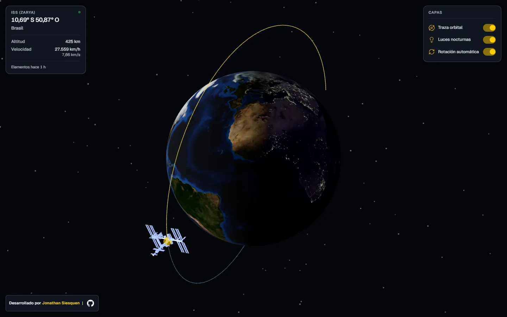
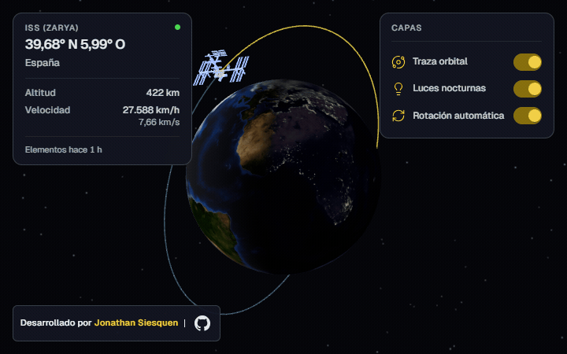
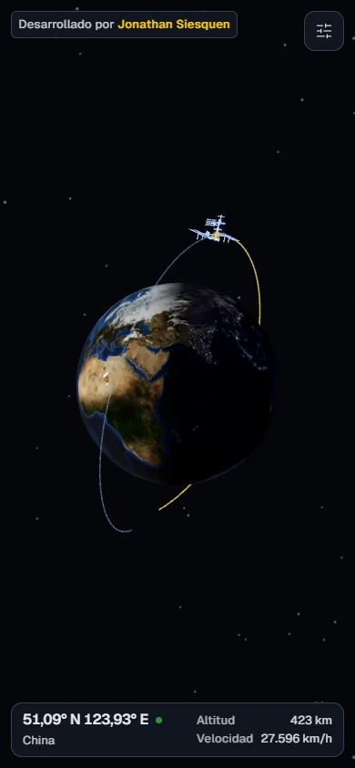
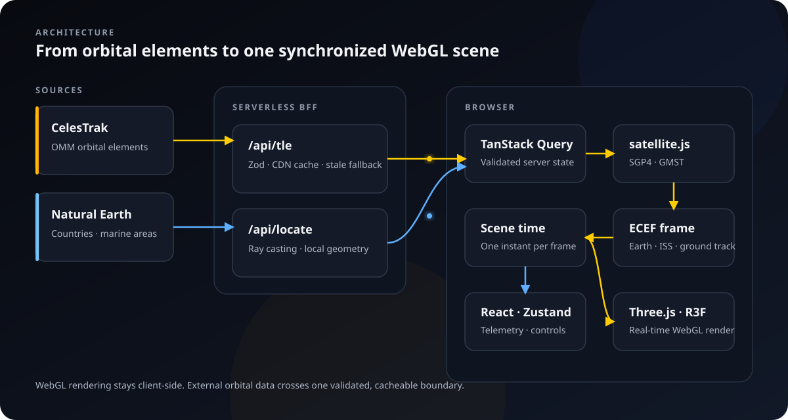

<div align="center">

# ISS Tracker

### The International Space Station's real position on a live 3D globe

[Versión en español](README.md)

[](https://iss-tracker-siesquen.vercel.app)
[](https://github.com/JpSiesquen/iss-tracker-siesquen/actions/workflows/ci.yml)



</div>

ISS Tracker does not receive a ready-to-render coordinate. It fetches OMM orbital elements,
validates them at a serverless boundary and **propagates the orbit with SGP4 in the browser**. A
single instant synchronizes the ISS position, Earth's rotation, the ground track and sunlight.

The result combines orbital computation, reference-frame transformations and WebGL rendering with
a responsive interface designed to keep the globe at center stage.

## At a glance

| Orbital computation | Synchronized scene | Production engineering |
| --- | --- | --- |
| Zod-validated OMM propagated through SGP4; position does not depend on a coordinates API. | ISS, Earth, track, Sun and night shader share one instant and coherent transformations. | Cached BFF with fallback, required CI, accessibility and measured mobile performance. |

## Demo

<div align="center">



_Orbital propagation and automatic rotation during a pass over Angola._

</div>

The application displays latitude, longitude, location, altitude, speed and orbital-element age.
Past and future ground tracks, city lights and automatic rotation can be toggled independently.

<details>
<summary><strong>Mobile view — pass over China</strong></summary>
<br />
<div align="center">
  
</div>
</details>

## Engineering behind the scene

### From orbital elements to a visible position

```text
OMM → Zod validation → SGP4 → ECI → geodetic / ECEF → Three.js
```

The BFF downloads the elements that describe the orbit from CelesTrak, not the current position.
In the browser, `satellite.js` builds the satellite record and SGP4 computes where the ISS will be
at each frame's instant. That position is converted from ECI to geodetic coordinates for telemetry
and to ECEF to place it above the rendered Earth.

### One clock for a coherent system

Earth's orientation is derived from Greenwich Mean Sidereal Time (GMST). `useSceneTime` computes a
single date, GMST value and Sun direction per frame; Earth, station, track and lights all consume
that shared state. The marker therefore cannot point to one country while the globe represents a
different instant.

### A continuous orbit across the antimeridian

Track points are connected after conversion to Cartesian coordinates. Longitudes 179.9° and
−179.9° remain close in 3D space, so the line crosses the antimeridian naturally without visual
patches or 359.8° jumps.

### External data behind a controlled boundary

The browser only calls `/api/tle` and `/api/locate`. The BFF validates OMM data, applies CDN caching
and can serve the latest known set if CelesTrak fails. Location is resolved locally against reduced
Natural Earth geometry; the client calls no third-party API.

## Architecture



The `scene/` and `ui/` boundary is structural: only Three.js objects live inside `<Canvas>`, while
telemetry and controls are accessible HTML overlays. TanStack Query owns server state; Zustand only
stores interface preferences.

```text
api/       Serverless BFF: OMM, caching and reverse geocoding
shared/    Executable contracts shared by server and client
src/api/   Validation, server state and telemetry
src/lib/   SGP4, coordinates, ground track and Sun position
src/scene/ WebGL scene built with React Three Fiber
src/ui/    Accessible HTML panels and controls
```

## Stack


| Area | Technologies |
| --- | --- |
| Interface | React 19, TypeScript, Material UI, Motion, Zustand |
| 3D | Three.js, React Three Fiber, drei, GLSL |
| Data | satellite.js, TanStack Query, Zod, Natural Earth |
| Platform | Vite 8, serverless functions, Vercel CDN |
| Quality | oxlint, Prettier, strict TypeScript, GitHub Actions |

## Performance, accessibility and reliability

- **1.92 s** until the scene is ready in a local Fast 4G measurement with preloads enabled.
- **86% less** transfer and **90% less** estimated VRAM for mobile textures.
- Device-aware textures preloaded from HTML and a responsive DPR limit.
- Keyboard navigation, semantic regions, announced states and AA contrast.
- `prefers-reduced-motion` support that preserves state-transition semantics.
- Visible stale-data state: the latest position is never silently presented as current.

The method, scenarios and limits behind these figures are documented in
[mobile performance](docs/rendimiento-movil.md).

## Run locally

Node.js and npm are required.

```bash
git clone https://github.com/JpSiesquen/iss-tracker-siesquen.git
cd iss-tracker-siesquen
npm ci
npm run dev
```

Vite opens the application at `http://localhost:5173` and proxies `/api` to the deployed BFF. Use
`vercel dev` when testing changes to serverless functions.

### Verification

```bash
npm run lint
npm run format:check
npm run test:locations
npm run test:sun
npm run test:scene
npm run test:omm
npm run build
npm run test:bundle
npm run test:preloads
```

The same sequence runs on every pull request, and `main` requires a green `verificar` check.

## Documented decisions

- [Local reverse geocoding and Natural Earth reduction](docs/geocodificacion.md)
- [Mobile performance profile and measurements](docs/rendimiento-movil.md)
- [Contribution, security and workflow conventions](CONTRIBUTING.md)
- Credits and licenses for [models](public/models/CREDITS.md),
  [textures](public/textures/CREDITS.md) and [social imagery](public/CREDITS.md)

## Contributors · development tools


Claude, OpenAI Codex and Cursor were used as engineering tools for analysis, implementation and
review. Product, architecture and acceptance decisions belong to the author and remain auditable
through issues, pull requests and commits.

## Author

**Jonathan Siesquen** — Full-stack TypeScript Developer with a frontend specialization

[](https://www.linkedin.com/in/jpsiesquen/)
[](mailto:jpsiesquen@gmail.com)
