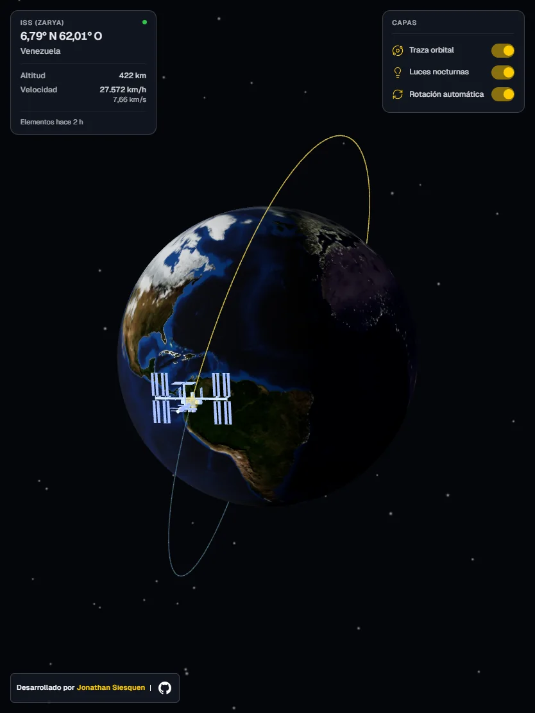

<div align="center">

# ISS Tracker

### La posición real de la Estación Espacial Internacional, sobre un globo 3D en tiempo real

[English version](README.en.md)

[](https://iss-tracker-siesquen.vercel.app)
[](https://github.com/JpSiesquen/iss-tracker-siesquen/actions/workflows/ci.yml)


</div>

ISS Tracker no recibe una coordenada preparada para dibujarla. Obtiene elementos orbitales OMM,
los valida en una frontera serverless y **propaga la órbita con SGP4 en el navegador**. Un mismo
instante sincroniza la posición de la ISS, la rotación terrestre, la traza y la iluminación solar.

El resultado combina cálculo orbital, transformaciones de referencia y renderizado WebGL con una
interfaz adaptable diseñada para que el globo siga siendo el protagonista.

## Lo esencial

| Cálculo orbital | Escena sincronizada | Producto listo para producción |
| --- | --- | --- |
| OMM validado con Zod y propagado mediante SGP4; la posición no depende de una API de coordenadas. | ISS, Tierra, traza, Sol y shader nocturno comparten el mismo instante y transformaciones coherentes. | BFF con caché y fallback, CI obligatorio, accesibilidad y perfil de rendimiento móvil medido. |

## Demo

<div align="center">


_Doce segundos de propagación orbital y rotación automática durante un paso sobre España._

</div>

La aplicación muestra latitud, longitud, ubicación, altitud, velocidad y antigüedad de los
elementos orbitales. La traza pasada y futura, las luces nocturnas y la rotación automática pueden
activarse por separado.

### Una experiencia que se adapta a cada pantalla

<div align="center">
  
  

_Móvil sobre Kazajistán · Tablet sobre Venezuela_
</div>

## Ingeniería detrás de la escena

### De elementos orbitales a una posición visible

```text
OMM → validación Zod → SGP4 → ECI → geodésicas / ECEF → Three.js
```

El BFF descarga de CelesTrak los elementos que describen la órbita, no la posición actual. En el
cliente, `satellite.js` construye el registro satelital y SGP4 calcula dónde estará la ISS para el
instante de cada frame. Esa posición pasa de ECI a coordenadas geodésicas para la telemetría y a
ECEF para situarla sobre la Tierra renderizada.

### Un único reloj para un sistema coherente

La orientación terrestre se deriva del tiempo sidéreo de Greenwich (GMST). `useSceneTime` calcula
una sola fecha, GMST y dirección solar por frame; Tierra, estación, traza y luces leen ese estado
compartido. Así, el marcador no puede apuntar a un país mientras el globo representa otro instante.

### Una órbita continua, incluso en el antimeridiano

La traza se conecta después de convertir cada punto a coordenadas cartesianas. Las longitudes
179,9° y −179,9° quedan próximas en el espacio 3D, por lo que la línea cruza correctamente el
antimeridiano sin parches visuales ni saltos de 359,8°.

### Datos externos detrás de una frontera controlada

El navegador solo consulta `/api/tle` y `/api/locate`. El BFF valida los OMM, aplica caché CDN y
puede servir el último conjunto conocido si CelesTrak falla. La ubicación se resuelve localmente
contra geometrías reducidas de Natural Earth; ninguna API de terceros se invoca desde el cliente.

## Arquitectura


La separación entre `scene/` y `ui/` es estructural: dentro de `<Canvas>` viven objetos de Three.js;
la telemetría y los controles son HTML accesible superpuesto. TanStack Query conserva el estado de
servidor y Zustand únicamente las preferencias de interfaz.

```text
api/       BFF serverless: OMM, caché y geocodificación inversa
shared/    contratos ejecutables compartidos por servidor y cliente
src/api/   validación, estado de servidor y telemetría
src/lib/   SGP4, coordenadas, traza y posición solar
src/scene/ escena WebGL con React Three Fiber
src/ui/    paneles y controles HTML accesibles
```

## Stack


| Área | Tecnologías |
| --- | --- |
| Interfaz | React 19, TypeScript, Material UI, Motion, Zustand |
| 3D | Three.js, React Three Fiber, drei, GLSL |
| Datos | satellite.js, TanStack Query, Zod, Natural Earth |
| Plataforma | Vite 8, funciones serverless, CDN de Vercel |
| Calidad | oxlint, Prettier, TypeScript strict, GitHub Actions |

## Rendimiento, accesibilidad y fiabilidad

- **1,92 s** hasta la escena lista en la medición local con Fast 4G y precargas activas.
- **−86 %** de transferencia y **−90 %** de VRAM estimada para texturas en móvil.
- Texturas específicas para móvil, precargadas desde el HTML, y DPR limitado según el dispositivo.
- Navegación por teclado, regiones semánticas, estados anunciados y contraste AA.
- `prefers-reduced-motion` respetado sin romper las transiciones de estado.
- Estado obsoleto visible: la última posición nunca se presenta silenciosamente como actual.

El método, los escenarios y los límites de estas cifras están documentados en
[rendimiento móvil](docs/rendimiento-movil.md).

## Ejecución local

Requiere Node.js y npm.

```bash
git clone https://github.com/JpSiesquen/iss-tracker-siesquen.git
cd iss-tracker-siesquen
npm ci
npm run dev
```

Vite abre la aplicación en `http://localhost:5173` y redirige `/api` al BFF publicado. Para probar
cambios en las funciones serverless, usa `vercel dev`.

### Verificación

```bash
npm run lint
npm run format:check
npm run test:locations
npm run test:sun
npm run test:scene
npm run test:omm
npm run build
npm run test:bundle
npm run test:preloads
```

El mismo recorrido se ejecuta en cada pull request y `main` exige el check `verificar` en verde.

## Decisiones documentadas

- [Geocodificación inversa local y reducción de Natural Earth](docs/geocodificacion.md)
- [Perfil y mediciones de rendimiento móvil](docs/rendimiento-movil.md)
- [Convenciones de contribución, seguridad y flujo](CONTRIBUTING.md)
- [Créditos y licencias de modelos](public/models/CREDITS.md),
  [texturas](public/textures/CREDITS.md) e [imágenes sociales](public/CREDITS.md)

## Contributors · herramientas de desarrollo


Claude, OpenAI Codex y Cursor se utilizaron como herramientas de ingeniería para análisis,
implementación y revisión. Las decisiones de producto, arquitectura y aceptación pertenecen al
autor y quedan auditables en issues, pull requests y commits.

## Autor

**Jonathan Siesquen** — Full-stack TypeScript Developer con especialización frontend

[](https://www.linkedin.com/in/jpsiesquen/)
[](mailto:jpsiesquen@gmail.com)
